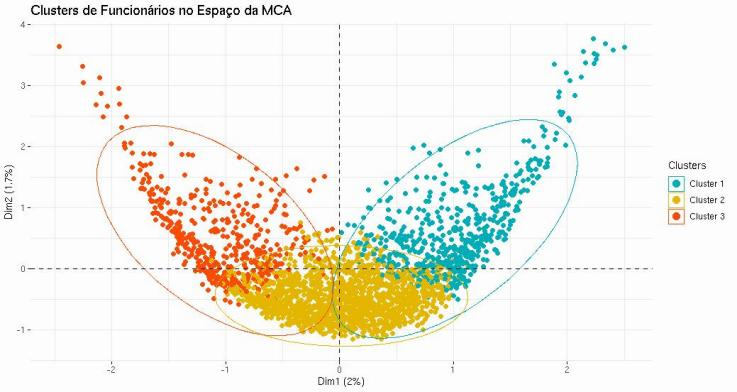

# Clustering - MCA e K-means
Autor: Rogério R R Coelho

O projeto consiste na análise de dados de uma pesquisa de aproximadamente 4.000 funcionários, onde cada um selecionou as três atividades de lazer de sua preferência a partir de uma lista de 45 opções. O conjunto de dados inclui as escolhas de cada funcionário, bem como sua divisão, departamento e escritório.

# 📊 Objetivo da Análise

Encontrar as similaridades (grupos mais similares) com base nas as preferências de atividades indicadas por cada funcionário.

# 📂 Base de Dados
As observações estão organizadas de modo que cada funcionário possui 3 linhas onde cada uma está uma atividade escolhida (departamento, divisão e escritório se repetem).
Todas as variáveis são categóricas. Com isso, Utilizei MCA com Kmeans para encontrar os grupos dado que MCA é técnica robusta para variáveis categóricas e nos permite que sejam estudadas as associações entre variáveis categóricas e suas categorias, bem como a intensidade de suas associações. Como resultado teremos valores numericos e com isso o K-means poderá ser utilizado para identificação dos grupos.
